# OKX-Bot Strategy V3.1 — Zero-Data-Cost 暴击流组合（扩频版）

> 目标：$7 → $50 · 设计时间：2026-06-25 15:00 · 版本：V3.0 → V3.1（2026-06-25 增 E/K/H 三条 edge，松绑跨所信号）· 设计人：量化研究员 / 算法工程师 / crypto 交易员三栈视角
>
> 本文件是 V1（`docs/design/strategy_plan.md`，已废止）与 V2（`docs/design/strategy_plan_v2.md`，被 `docs/report/PHASE_0_REPORT.md` 与 `docs/discussions/2026-06-25-okx-algo.md` 联合证伪/否决）的**结构性替代方案**，对应 V2 §3 Option B 主线 + 多 edge 并行扩展。
>
> Status：approved-for-gated-live（2026-06-25 21:28 二审通过；允许进入 research/backtest，且仅在 §18 全部闸门 PASS 后启动 `$7 → $50` live α）
>
> **V3.1 增量摘要**：V3.0 的 A/B/C/D 4 条 edge 在 7 天内合计 ~22-28 setup 偏薄；V3.1 引入 **E**（pre-funding settlement unwind）、**K**（同主题 alt pair MR）、**H**（OI velocity + 价格滞涨）三条中频 edge，目标把 setup 数拉到 80-150，但该频次仅是研究假设，必须由 §18.4 横向回测实证确认。同时松绑 §13.1「不读跨所信号」——允许第三所公告/价格作为入场依据，**但交易腿 100% 锁 OKX 永续不变**。

***

## 0. TL;DR

**V3.1 = 7 条 zero-data-cost edge 的暴击流组合 + 共享暴击流仓位状态机 + 复用现有 backtest 骨架。**

- V1 已死：200-400ms 延迟 vs HFT 同向追清算 = 物理上输。
- V2 主策略已死：清算流真实数据在 2026 全员 paywall（Binance 下架、Coinbase 限流、Coinglass/Tardis 收费），$7 本金 × $30/月数据费 = 长期 EV 永负。
- V3.1 撤掉对清算流的依赖，在 zero-data-cost 范围内组合 **7** 条**散户行为型** edge（数据完全靠 OKX 与第三所的公开免费 API；**信号可跨所，下单仅 OKX 永续**），用暴击流仓位规则去吃右尾路径。
- 7 条 edge = **A** 上市 fade（事件主线）+ **B** funding 极值反转 + **C** BTC-Alt β decoupling + **D** 周末 wick fade + **E** pre-funding settlement unwind + **K** 同主题 alt pair MR + **H** OI velocity + 价格滞涨。setup 期望 **80-150/周** 是 Phase 0.5 要验证的假设，不作为未回测前的承诺。
- 主目标：$7 → $50；副目标：7 条 edge 的横向 Phase 0 回测报告 + 可复用 Paper→Live 框架；实盘 $7 是通过 §18 全部硬闸门后的暴击流压力测试，爆仓也认。
- 数学诚实：$7→$50 / 7 天隐含 daily edge ≈ 33%（V2 §9 也认），不存在稳定策略复利得出，**只在右尾路径上成立**（概率估：V3.0 时 15–65%；V3.1 频次拉上来后估 25–75%）。"$50 是娱乐，框架是资产"——目标重定义后此设计才自洽。

***

## 1. 决策背景：从废墟里凝结出来的硬约束

### 1.1 V1/V2 死因复盘

| 方案                | 核心思路               | 死因                                                                               | 不可逆程度     | 来源                                                       |
| ----------------- | ------------------ | -------------------------------------------------------------------------------- | --------- | -------------------------------------------------------- |
| V1：微观结构动量点火       | 追清算级联早期入场，市价单跟单    | 200-400ms 延迟下与 HFT 同向竞速；点火信号 OFI/OI 在 sub-second 尺度，本地代理永远是最后一棒接盘者               | 物理不可逆     | `strategy_plan.md` §2/§4，`2026-06-25-okx-algo.md` §3     |
| V2 主：清算尾声 fade    | 让清算冲完做对手盘          | 真实清算 tick 流 2026 全员 paywall；用 OI 5min diff 代理回测胜率 10.99% / EV -0.41R，结构性 4-5σ 否定 | 数据基建不可逆   | `PHASE_0_REPORT.md` §2/§3/§10                            |
| V2 辅：新合约 fade（§3） | 上市后 pump-then-fade | 写了雏形但**未回测验证**，工程完全没动                                                            | 这是 V3 的入口 | `strategy_plan_v2.md` §3，`2026-06-25-okx-algo.md` §建议第1段 |

### 1.2 三维硬约束（写在最显眼处，违反任何一维即作废）

| 维度   | 数值            | 含义                                                                    |
| ---- | ------------- | --------------------------------------------------------------------- |
| 资金   | **$7**        | 任何 ≥ $5/月固定订阅都让 EV 长期为负                                               |
| 数据预算 | **$0/月**      | Coinglass Hobbyist $29 / Tardis ≥ $80 全部出局；只能用 OKX + Binance 免费公共 API |
| 网络延迟 | **200-400ms** | 信号尺度 ≥ 1 分钟才能容忍；sub-second 类策略物理出局                                    |

这三维同时成立，**几乎排除了** 90% 的常见 crypto 量化策略路径——但不排除 V3 列举的 4 条 edge。

### 1.3 暴击流（Critical Strike）真实含义校准

[goodpropfirm 原文](https://goodpropfirm.com/critical-strike/) 实际把暴击流定义为「**重仓搏单趋势**」的快富神话，并在 prop firm 评估账户语境下**强烈反对**（因为 consistency rule / 日内 DD 限制让暴击流必死）。

但 prop firm 评估账户的两条限制（consistency、daily DD）**与本项目无关**——这是用户**私人资金**，没有 platform-level consistency rule，daily DD 是自己设的。所以暴击流在此处的可用版本是：

> **重仓 + 单笔 R 严格定死 + 命中不眷恋 + 不犹豫止损 + 不补仓 + 命中后强制提现到生存池。**

这与用户原文「我他娘的怎么干它几单翻上几倍积累原始资本」+「可以接受每单用全仓去打，然后设置止损退出保全一些本金」高度一致。暴击流**不是**「无止损 / 一把梭哈赌国运」，而是**有限子弹数下的右尾期望最大化**。详见 §7。

### 1.4 心理预期校准（数学版）

$$
\text{daily return required} = \left(\frac{50}{7}\right)^{1/7} - 1 \approx 33.4%/\text{day}
$$

地球上不存在能稳定复利出 33% / day 的策略。所以本设计的 EV 数学**不是**"找一条 daily 33% 的 edge"，而是：

- **单 edge 单笔** EV 维持在 +0.3R \~ +0.5R 的合理区间（与 Phase 0 验收一致）
- 暴击流仓位规则使单笔权益变动放大到 +30% \~ +50%
- 7 天内只需要 **5-8 次净胜** 就达到 $50（详见 §7 §10 蒙特卡洛粗算）
- 路径概率落在 V2 §9 估的 15-65% 区间内

***

## 2. Edge 蓝图（zero-data-cost 候选集）

### 2.1 准入准则（任一不满足即出局）

1. **散户行为根源**：edge 的存在依赖散户结构性行为偏差（FOMO、拥挤多头、薄盘流动性）；机构主导 / 套利已收敛的 edge 全部出局。
2. **数据 $0 成本**：仅用 OKX 公开 REST/WS + Binance 公开数据。
3. **延迟容忍 ≥ 1 分钟**：信号在 1m bar 尺度上稳定，200-400ms 延迟不破坏入场窗口。
4. **OKX 永续可执行**：标的在 OKX SWAP 上，且 leverage cap 允许 ≥ 5x。
5. **频次匹配**：每 strategy 至少 ≥ 1 笔/周（事件型）或 ≥ 1 笔/天（bar 型）。
6. **证据闸门**：任何 edge 进入 ensemble 或 live 前，必须先产出真实回测报告，且报告覆盖样本数、胜率、EV(R)、PF、最大连亏、交易成本、滑点敏感性、参数敏感性、按 symbol/hour 分组。

### 2.2 候选 → 入选清单（V3.1：8 候选 → 7 入选 + 1 辅助层 + 1 backlog）

| ID | 名称 | Edge 根源 | 数据 | 主要风险 | 入选 |
|---|---|---|---|---|---|
| **A** | OKX 新合约上市 Fade | 散户公告 FOMO + OKX 新上市自动 leverage 收紧 trap 多头 | OKX `/instruments` + 公告页 + 1m kline | 上市样本 2-4/周，事件稀疏 | **事件主线 ★** |
| **B** | Funding Rate Extremes Reversion | 杠杆方向过度集中后 unwind | OKX `/funding-rate-history` + `/open-interest`（30 天 z-score） | 强趋势下 funding 可持续高（CoinGecko 2024 BTC 案例） | **次线** |
| **C** | BTC-Alt β Decoupling Reversion | BTC 不动时 alt 单边情绪偏离均值回归 | OKX 1m kline（BTC + alt list） | 牛/熊整体趋势期信号稀疏 | **三号** |
| **D** | 周末/低流动性 Wick Fade | UTC 周末流动性下降 30-50%（CoinGecko 2025 数据），薄盘 wick 后回归 | OKX 1m kline | 整体波动萎缩；样本短 | **四号** |
| **E** | Pre-funding Settlement Unwind | OKX funding 每 8h 结算前 30-60min，拥挤方向 preemptive close → MR | OKX funding + OI（B 数据复用） | 窗口 micro；触发频次依赖币种宽度 | **V3.1 新增 · 频次主力** |
| **K** | 同主题 Alt Pair MR | 同 narrative 桶 alt 可能存在短期均值回归；先做 cointegration 筛选，再做 log-ratio z 偏离 → MR | OKX 多 alt 1m kline + 桶级动量过滤 + cointegration 检验 | narrative 转换让 cointegration 崩溃；两腿管理复杂；$7 小账户可能因最小下单失败 | **V3.1 新增 · 研究候选** |
| **H** | OI Velocity + 价格滞涨 | OI 累积 + 价格未跟随 → 库存堆积，下根 5-15min bar 爆发后 MR | OKX OI 1h diff + 1m kline | OI 数据 1h 粒度滞后；爆发可能延续不 MR | **V3.1 新增 · 微观结构层** |
| L | Long/Short ratio 极值反转 | 散户拥挤 contrarian | OKX position info | 单独信号不够，必须与 funding/OI 同向 | **辅助 ensemble 层**（V3.0 原 E 重编号） |
| G | 第三所上市公告 spillover | Binance/Coinbase/Upbit 上市 → OKX 同币 momentum 后 fade | 第三所公告 RSS + OKX 1m kline | 信号源稳定性需 sign-off；firehose 噪声 | **V3.2 backlog**（§13.1 跨所信号已松绑前提） |

### 2.3 7 条 edge 横向参数表（设计时锁定值）

> 为表格可读，按 **事件型** 与 **连续/MR 型** 分两张表。

#### 表 2.3.A 事件型（A、D）

|  | A 上市 fade | D 周末 wick |
|---|---|---|
| 信号尺度 | 5-30 min | 5-60 min |
| 入场触发 | 上市后 5min high 回踩 0.85-0.88 区间（A1）/ 二次冲高动能衰减（A2） | UTC Fri22-Sun22 & 1m close 在 5m bar 0.95 quantile 之外 |
| 方向 | 优先做空（多头被 leverage cap 锁死） | 反向 fade wick |
| 出场目标 | 回到上市开盘价 ± k×ATR(5m) | 回到 5m bar 中位数 |
| 时间止损 | 30 min（A1）/ 20 min（A2） | 60 min |
| 硬止损 | 破前高 × 1.02（A1）/ × 1.005（A2） | 1.0×ATR(5m) |
| 频率假设 | ≥ 2 笔/周 | ≥ 4 笔/周 |
| 杠杆上限 | OKX 实际 cap（常见 5-10x） | 5-7x |
| 1R = | 30% equity（α 阶段） | 15% equity |

#### 表 2.3.B 连续 / MR 型（B、C、E、K、H）

|  | B funding 反转 | C β decoupling | E pre-funding unwind | K pair MR | H OI velocity |
|---|---|---|---|---|---|
| 信号尺度 | 1-8 h | 60 min | 30-90 min（结算窗） | 60-90 min | 5-15 min |
| 入场触发 | funding z ≥ +2.5σ & OI/vol > P80 & 价格未跟随 | BTC 60min RV < P30 & alt 60min z > +2.5 | 结算前 60min & \|funding z\| ≥ 2.0 & OI z ≥ 1.5 & 价格已反向 | 桶内 pair log-ratio \|z\| ≥ 2.0 & 桶级动量 ≤ P50 | OI velocity > P95 & price delta < P30 → 等爆发 → fade |
| 方向 | 反向 fade（z>0 做空，z<0 做多） | 反向 fade alt | 反向 fade（fund 极值反向） | 高 z 腿做空 + 低 z 腿做多 | 反向 fade 爆发 |
| 出场目标 | funding 回归 \|z\| ≤ 0.5 | 偏离回归 50% | 结算后 \|z\| ≤ 1.0 或 价格 MR 50% | ratio z 回归 \|z\| ≤ 0.5 | 回爆发前价格 ± 0.3×ATR(5m) |
| 时间止损 | 24 h（≈3 funding 周期） | 90 min | 90 min（含结算后 30min） | 90 min | 15 min |
| 硬止损 | 反向 1.5×ATR(4h) | 偏离的 1.2 倍 | 1.0×ATR(1h) | ratio z 进一步至 ±3.0 | 1.0×ATR(5m) |
| 频率假设 | ≥ 1 笔/天（跨币聚合） | ≥ 1 笔/天 | ≥ 5 笔/天 | ≥ 3 笔/天 | ≥ 3 笔/天 |
| 杠杆上限 | 6-8x | 8-10x | 6-8x | 8-10x（两腿对冲） | 8-10x |
| 1R = | 20% equity | 20% equity | 18% equity | 15% equity（两腿合计） | 18% equity |

#### 文献 / 经验依据

| edge | 来源 |
|---|---|
| A | OKX 学习中心 alt pump 节奏 + github okx-exchange 上市自动挂单工具广泛存在 → 行为可重复 |
| B / E | [Yellow.com 2025 funding 反转](https://yellow.com/learn/how-to-read-funding-rates-crypto-reversals)、[ScienceDirect 2025 funding arbitrage](https://www.sciencedirect.com/science/article/pii/S2096720925000818)；**E 是 B 的 micro-window 结算前版本** |
| C / K | [arxiv 2602.00776 microstructure](https://arxiv.org/html/2602.00776v1) cross-asset 短期 reversion；**K 仅在 ADF / Engle-Granger / half-life 三项筛选通过后才允许视为 pair MR** |
| D | [BitMEX state of perps 2025](https://www.bitmex.com/blog/state-of-crypto-perps-2025) + 周末薄盘观察 |
| H | OI 累积 leading indicator 在 [arxiv 2602.00776](https://arxiv.org/html/2602.00776v1) 与 funding/OI fragility 文献中均有论证；本设计取其 "OI 滞涨后必爆 → fade 爆发回归" 路径 |

***

## 3. Strategy A：OKX 新合约上市 Fade（**主策略**）

### 3.1 假说与三层证据

**核心假说**：OKX 永续上市 0-30 分钟内 IV 与单边情绪极高，散户公告后 FOMO 推升价格 → 后续抛压；同时 OKX 对新上市永续**自动收紧 leverage 至 3-5x**（搜索证实，详见 [OKX leverage limits 说明](https://github.com/utrqe38/okx-leverage-limits)），结构上限制了多头加杠杆的能力，反向 fade 因此具备非对称 R:R。

**三层证据**：

1. **结构性证据（leverage cap）**：OKX 新上市自动 3-5x，多头无法承接散户 FOMO，市价单冲高后通常 5-15 分钟内回吐 50%-80%。
2. **历史观察（github 自动化工具普遍存在）**：[`pump-and-dump`](https://github.com/topics/pump-and-dump) [topic](https://github.com/topics/pump-and-dump) + [okx-exchange topic 内 OKX 上市自动 sell limit 脚本](https://github.com/topics/okx-exchange) 之普遍说明这条 edge 是**散户群体熟知但仍持续可用**——因为参与者多是单方向 sell，反向 buy fade 也成立。
3. **公告时间确定性**：OKX 提前 30-60 分钟公告上市时刻，**零延迟竞赛**，与 V1 的 sub-second 物理劣势完全脱钩。

### 3.2 数据来源（全部 OKX REST 免费）

| 数据           | endpoint                                                               | 频率                           |
| ------------ | ---------------------------------------------------------------------- | ---------------------------- |
| 上市公告         | OKX `/api/v5/support/announcements?annType=announcements-new-listings` | 每 5 分钟                       |
| 全量合约清单       | `/api/v5/public/instruments?instType=SWAP`                             | 每日 diff（识别新增）                |
| 1m kline     | `/api/v5/market/candles?bar=1m`                                        | live 时 WS subscribe；回测时 REST |
| 指数价（参照）      | `/api/v5/market/index-tickers`                                         | 与 mark price 对照              |
| Leverage cap | `/api/v5/account/max-leverage?instId={}`                               | 上市时实测                        |

### 3.3 信号定义（A1: Pump-then-Fade，主入场）

**记号**：上市时刻 $t\_0$，$t\_0$ 后第 $i$ 根 1m bar 的 OHLC 为 $(O\_i, H\_i, L\_i, C\_i)$。

**触发条件（全部 AND）**：

| 条件              | 表达式                                                     | 阈值（默认）            |
| --------------- | ------------------------------------------------------- | ----------------- |
| C1 已 pump       | $\max(H\_0, \ldots, H\_4) / O\_0 \geq 1.15$             | 上市后 5min 涨幅 ≥ 15% |
| C2 5m bar 形态确认  | $\sum\_{i=0..4} \text{vol}\_i$ ≥ 该币种 24h 均量等比例 ≥ 期望值    | 流动性确认（避免假突破）      |
| C3 回踩区间         | $H \times 0.85 \leq P\_{\text{now}} \leq H \times 0.88$ | 回踩 12-15%         |
| C4 回踩动能减速       | 1m bar 收阴 + volume 较 pump 期回落 ≥ 50%                     | 抛压减速（fade 入场）     |
| C5 leverage cap | $L\_{\text{OKX}} \geq 5$                                | 没杠杆就放弃            |

**入场**：post-only limit SELL at $P\_{\text{now}}$；未成交在 2 分钟内放弃。

**目标**：$O\_0 \pm k \times \text{ATR}\_{5m}$，默认 $k = 0.5$，方向：return-to-open。

**硬止损**：$H \times 1.02$（破前高 2%，逻辑：突破前高 → fade 假设破裂）。

**时间止损**：入场后 30 分钟未触发目标 → 市价平仓。

### 3.4 信号定义（A2: Echo / Re-pump Fade，OKX 永续内）

**适用场景**：A1 未触发或已止损出场，但**同一上市事件**在 15-60 分钟窗口内出现"二次冲高"——次高未破前高、且动能明显衰减。仍在 OKX 永续上做空，作为该上市事件的第二颗子弹。

**记号**：1st pump 主高 $H\_1$ 出现在 $t\_0 + i\_1$（$i\_1 \leq 5$），2nd pump 次高 $H\_2$ 出现在 $t\_0 + i\_2$（$15 \leq i\_2 \leq 60$）。

**触发条件（全部 AND）**：

| 条件               | 表达式                                                                             | 阈值                 |
| ---------------- | ------------------------------------------------------------------------------- | ------------------ |
| C1 1st pump 已发生  | $H\_1 / O\_0 \geq 1.15$                                                         | A1 入场前提            |
| C2 2nd 次高未破前高    | $0.85 \leq H\_2 / H\_1 < 1.00$                                                  | 二次冲高但弱于首峰          |
| C3 动能衰减          | $\text{vol}(H\_2 \pm 2\text{min}) / \text{vol}(H\_1 \pm 2\text{min}) \leq 0.70$ | 第二波接力意愿弱           |
| C4 funding 转正/上行 | funding rate 较 $H\_1$ 时刻上行 ≥ 50% 或 z 转正                                         | 多头加仓证据（暴露给反转的散户库存） |
| C5 leverage cap  | $L\_{\text{OKX}} \geq 5$                                                        | 同 A1               |

**入场**：post-only limit SHORT at $H\_2 \times \[0.985, 0.99]$（紧贴次高下方接卖单）；2 分钟未成交放弃。

**目标**：返回 $H\_1$ 与首峰后 swing low 之间的中位价 $\pm 0.5 \times \text{ATR}\_{5m}$。二次回调通常比首次浅，目标比 A1 紧。

**硬止损**：$H\_1 \times 1.005$（**0.5% 比 A1 的 2% 更紧**）——理由：二次冲高破前高 = 散户接力意愿仍强，A2 假设彻底破裂，立刻退出。

**时间止损**：入场后 20 分钟。

**入场预算**：与 A1 共享仓位 R 规则；**单上市事件 A1 + A2 合计入场次数 ≤ 3**（A1 ≤ 2 + A2 ≤ 1）。A1 当前仍在仓则 A2 自动跳过。

**为什么这仍是暴击流而非"找回"加仓**：A2 是**独立信号 + 独立 1R**，不是 A1 失败后摊平成本；触发条件比 A1 更严（动能确认 + funding 转正双重门槛），失败成本被 0.5% 止损卡死。属于"该上市事件还剩一颗子弹"的右尾打法，不是马丁格尔。

> 与 V2 §3 的对位：V2 §3 的"B. Pre-list straddle on correlate"依赖 Gate/MEXC 现货腿，违反本设计「只在 OKX、只做永续」硬约束（详见 §13.1），**显式作废**；此处 A2 是 OKX 永续单腿的等价位变体。

### 3.5 仓位

- 杠杆：`min(L_OKX_实际, 10x)`
- 单笔 1R：α 阶段 30%，β 阶段 20%（详见 §7）
- A1 单信号最多入场 2 次（第一次未触发或 stopped → 看到二次回踩可再试一次），fail-fast
- **单上市事件 A1 + A2 合计入场 ≤ 3 次**（见 §3.4 入场预算）

### 3.6 验收门槛（A 单独）

| 指标            | 阈值         | 备注                          |
| ------------- | ---------- | --------------------------- |
| 样本数           | ≥ 30 个上市事件 | 6 个月 OKX 新永续约 50-80 个       |
| 胜率            | ≥ 55%      | <br />                      |
| EV(R)         | ≥ +0.4     | 高于 Phase 0 通用 +0.3，因事件稀疏样本贵 |
| Profit Factor | ≥ 1.5      | <br />                      |
| 信号频次          | ≥ 2 笔/周    | OKX 新永续 2-4/周               |
| 最大连亏          | ≤ 5        | <br />                      |

***

## 4. Strategy B：Funding Rate Extremes Reversion（次线）

### 4.1 假说

资金费率（funding rate）= 永续与现货价差的**仓位过度集中代价**。当 funding rate 偏离 30 天 rolling 均值的 z-score ≥ +2.5σ（多头过度拥挤），同时 OI/24h-volume 比值处于该币 30 天 P80 以上（杠杆库存高），则：

1. 持仓成本对多头形成累积压力
2. 任何价格回落都可能触发 unwind 的级联（CoinGecko 数据：2024 BTC funding 持续正但价格继续涨——但 2025 Oct-6 funding 升至 30% 年化后 24h 内 1.6M 仓位被清算，[FTI Consulting / yellow.com 分析](https://yellow.com/learn/how-to-read-funding-rates-crypto-reversals)）
3. 反向 fade 在 24h 时间窗口内 mean reversion 概率高

### 4.2 文献支持与警告

- **支持**：ScienceDirect 2025 funding arbitrage paper 显示「funding rate 套利 EV 与 HODL 接近但波动率显著更低」，作为风险分散有意义。
- **警告 1**（强趋势期失效）：CoinGecko 2025 年报指出 2024 年 BTC funding 全年仅 26 天为负但 BTC 翻倍。**naive 高 funding 做空在趋势市必死**。
- **警告 2**（执行成本被严重低估）：[AutoQuant 2025 框架](https://arxiv.org/) 指出 fee-only / zero-cost 回测会**显著高估**年化收益；fully-costed 配置下大量 funding arb 收益消失，95% 机会被 forced exits。

### 4.3 信号定义（**B1：funding z-score 反转**）

**预处理**（每币种）：

```
funding_z(t) = (funding(t) - mean(funding, 30d)) / std(funding, 30d)
oi_pct(t)    = percentile_rank(oi/24h_vol, 30d)
```

**触发条件（全部 AND）**：

| 条件            | 表达式                                       | 阈值                      |
| ------------- | ----------------------------------------- | ----------------------- |
| C1 funding 极值 | `abs(funding_z) ≥ 2.5`                    | z-score 单尾              |
| C2 OI 拥挤      | `oi_pct > 0.80`                           | 杠杆库存确认                  |
| C3 价格未跟随      | `sign(price_1h_return) ≠ sign(funding_z)` | 提前 unwind 苗头（多头拥挤但价格没涨） |
| C4 流动性        | 24h volume ≥ $20M                         | <br />                  |

**方向**：`signal = -sign(funding_z)`。多头拥挤 → 做空，空头拥挤 → 做多。

**入场**：post-only limit at mid。

**目标**：等待 funding 回归至 `abs(funding_z) ≤ 0.5`，或 8h 内未到目标但 funding 已开始衰减 → 时间出场。

**硬止损**：反向 1.5 × ATR(4h)。

**时间止损**：3 × funding 周期 = 24h（OKX funding 8h 一次）。

### 4.4 仓位

- 杠杆：6-8x（funding 持续可与你对抗，仓位不能过高）
- 1R = 20% equity

### 4.5 验收门槛

| 指标       | 阈值            |
| -------- | ------------- |
| 90 天回测样本 | ≥ 80 笔        |
| 胜率       | ≥ 55%         |
| EV(R)    | ≥ +0.3        |
| PF       | ≥ 1.4         |
| 信号频次     | ≥ 1 笔/天（跨币聚合） |
| 最大连亏     | ≤ 6           |

***

## 5. Strategy C：BTC-Alt β Decoupling Reversion（三号）

### 5.1 假说

当 BTC 60 分钟 realized vol 处于 30 天 P30 以下（BTC 近乎静止），但某 alt 60 分钟 z-score 偏离 ≥ 2.5σ：

- BTC 不动说明全市场无强 macro 驱动
- alt 偏离均值多半来自**单一 alt 内部杂音 / 散户情绪**
- 60 分钟内 mean reversion 概率高（[arxiv 2602.00776](https://arxiv.org/html/2602.00776v1) microstructure 短期回归证据）

### 5.2 信号定义

```
btc_rv_pct = percentile_rank(realized_vol(BTC, 60m), 30d)
alt_z      = (close - vwap(alt, 60m)) / std(close, 60m)
```

**触发**：

| 条件         | 阈值                  |
| ---------- | ------------------- |
| C1 BTC 静止  | `btc_rv_pct < 0.30` |
| C2 alt 偏离  | `abs(alt_z) ≥ 2.5`  |
| C3 alt 流动性 | 24h volume ≥ $10M   |
| C4 alt 非新币 | 上市 ≥ 30 天（避免与 A 重叠） |

**方向**：`signal = -sign(alt_z)`，反向 fade。

**目标**：alt 偏离回归 50%（即 `z` 从 ±2.5 回到 ±1.25）。

**硬止损**：alt 偏离的 1.2 倍（z 走到 ±3.0）。

**时间止损**：90 分钟。

### 5.3 仓位

- 杠杆：8-10x
- 1R = 20% equity

### 5.4 验收门槛

| 指标     | 阈值      |
| ------ | ------- |
| 90 天样本 | ≥ 60 笔  |
| 胜率     | ≥ 55%   |
| EV(R)  | ≥ +0.3  |
| PF     | ≥ 1.4   |
| 信号频次   | ≥ 1 笔/天 |

***

## 6. Strategy D：周末低流动性 Wick Fade（四号）

### 6.1 假说

[BitMEX State of Perps 2025](https://www.bitmex.com/blog/state-of-crypto-perps-2025) 数据：周末 UTC Fri 22:00 - Sun 22:00 的全市场 perp 流动性下降 30-50%。薄盘下大单容易制造 wick，wick 后 1-2 小时内回归 5m bar 中位数概率高（散户单笔砸盘后无后续接力）。

### 6.2 信号定义

```
in_window = UTC weekday in [Fri 22:00, Sun 22:00]
bar_range = (high_5m - low_5m)
wick_threshold = 0.95 quantile of (price - vwap_5m) over rolling 7d 同时段
```

**触发**：

| 条件         | 阈值                                       |
| ---------- | ---------------------------------------- |
| C1 时间窗口    | `in_window == True`                      |
| C2 wick 触发 | 1m close 在 5m bar range 0.95 quantile 之外 |
| C3 wick 回弹 | 紧接的 1m bar 反向 ≥ wick 距离的 30%             |
| C4 流动性     | 该币种 24h volume ≥ $5M                     |

**方向**：fade wick 方向，回归 5m bar 中位数。

**目标**：返回 5m bar 中位数。

**硬止损**：1.0 × ATR(5m) 反向。

**时间止损**：60 分钟。

### 6.3 仓位

- 杠杆：5-7x（周末样本少 + 外溢风险）
- 1R = 15% equity

### 6.4 验收门槛

| 指标          | 阈值      |
| ----------- | ------- |
| 90 天样本（仅周末） | ≥ 40 笔  |
| 胜率          | ≥ 55%   |
| EV(R)       | ≥ +0.3  |
| PF          | ≥ 1.4   |
| 信号频次        | ≥ 4 笔/周 |

***

## 6.5 Strategy E：Pre-funding Settlement Unwind（V3.1 新增 · 频次主力）

### 6.5.1 假说

OKX 永续 funding 每 8h 结算（UTC 00:00 / 08:00 / 16:00）。结算前 30-60 分钟内，若某币 funding rate 已 z-score 极值 + OI 处于高位 + 价格已开始反向：

1. 拥挤方向（高 funding 多头 / 极负 funding 空头）开始 preemptive close，避免下一期 funding 成本
2. → 价格回吐拥挤方向的部分涨/跌
3. → mean reversion 概率高，且窗口短（90 分钟内）

**与 B 的核心区别**：

- B 是"funding 极值后 24h 内反转"——慢节奏，跨多个结算周期
- E 是"funding 结算前 30-60 分钟"——micro window，触发更精准、止损更紧、频次更高
- B 触发是必要条件（funding z），E 在 B 基础上叠加**时段窗口 + 反向价格证据**两个加强约束

### 6.5.2 数据

完全复用 B 的数据（OKX funding history + OI history + 1m kline），**零新增付费数据源**。

**点时可得性要求**：E/B 回测必须区分 `live 可见 funding` 与 `事后 settled funding history`。若 OKX 只能稳定返回 settled funding，则 E 不能使用 `settlement - 60min` 时尚未落库的最终 funding 值，必须改用当时 API 可见的 next funding / predicted funding 字段；否则判定为 lookahead bias，策略 ABORT。

**funding cashflow 建模**：所有跨结算时点持仓必须把实际 funding payment 计入 PnL，输出 `price_pnl_R`、`funding_pnl_R`、`fee_slippage_R` 三列。若 funding cashflow 缺失，E/B 报告不得 PASS。

### 6.5.3 信号定义

**预处理**（每币种、每个结算窗口前 60min 触发）：

```
funding_z(t)    = (funding(t) - mean(funding, 30d)) / std(funding, 30d)
oi_z(t)         = (oi/24h_vol(t) - mean, 30d) / std, 30d
price_delta(t)  = price(t) - price(t - 30min)
```

**触发条件（全部 AND）**：

| 条件 | 表达式 | 阈值 |
|---|---|---|
| C1 时段窗口 | `t ∈ [settlement - 60min, settlement - 5min]` | 硬窗口（3 次/天）|
| C2 funding 极值 | `abs(funding_z) ≥ 2.0` | 比 B 的 2.5 略松（窗口短，需更易触发）|
| C3 OI 拥挤 | `oi_z ≥ 1.5` | 杠杆库存确认 |
| C4 价格已反向 | `sign(price_delta) ≠ sign(funding_z)` | "聪明钱"已先动 |
| C5 流动性 | 24h volume ≥ $10M | |

**方向**：`signal = -sign(funding_z)`，反向 fade。

**入场**：post-only limit at mid。

**目标**（满足其一即出）：
1. 结算后 API 已发布 settled funding，且按点时可见数据计算 `|z| ≤ 1.0` → 平仓
2. 或 价格已 mean revert 50% → 平仓

**硬止损**：1.0 × ATR(1h)。

**时间止损**：结算后 30 分钟（整个窗口最多持仓 90 分钟）。

### 6.5.4 仓位

- 杠杆：6-8x
- 1R = 18% equity（比 B 的 20% 略保守，micro window 风险集中）

### 6.5.5 频次假设

- 3 个 funding 结算窗/天 × ~50 alt 标的 × ~10% 触发率 → **5-15 setup/天**

### 6.5.6 验收门槛

| 指标 | 阈值 |
|---|---|
| 30 天回测样本 | ≥ 60 笔 |
| 胜率 | ≥ 55% |
| EV(R) | ≥ +0.25（结算窗 R 摊薄但频次密）|
| PF | ≥ 1.4 |
| 信号频次 | ≥ 5 笔/天（跨币聚合）|
| 最大连亏 | ≤ 6 |

***

## 6.6 Strategy K：同主题 Alt Pair MR（V3.1 新增 · 频次主力）

### 6.6.1 假说

crypto 内存在明显的 **narrative 桶**。但“同桶”只能说明共同题材暴露，不等于 cointegration。K 的可交易假说改为：先用统计检验筛出稳定 pair，再在该 pair 的 log-ratio z-score 偶尔偏离 ≥ 2σ 时做短期 MR。偏离主要源于：

- 桶内一只 alt 被单独哄抬 / 抛售（散户 / Twitter 热点）
- 流动性差异在某 alt 上集中

只有当 pair 通过 cointegration 与 half-life 筛选、且桶内整体动量保持中性时，z-score 回归概率才足够高。否则 K 自动跳过，不允许用“同主题”直接开双腿仓。

### 6.6.1.1 Pair 准入检验

每个候选 pair 在进入信号计算前必须通过以下全部筛选：

| 检验 | 阈值 | 失败处理 |
|---|---|---|
| ADF on ratio | p-value ≤ 0.05 | 该 pair 禁用 |
| Engle-Granger | p-value ≤ 0.05 | 该 pair 禁用 |
| half-life | 10min ≤ half-life ≤ 360min | 过短视为噪声，过长不适合 90min 持仓 |
| rolling corr 稳定性 | 30d rolling corr P25 ≥ 0.50 | 相关结构不稳，禁用 |
| structural break | 最近 7d beta drift ≤ 30d beta 的 2σ | narrative 切换，禁用 7 天 |

### 6.6.2 标的 Universe（首批，全部 OKX 永续）

| 桶 | 标的（按 OKX SWAP 流动性筛后 3-4 个）| pair 候选数 |
|---|---|---|
| AI | FET, RNDR, TAO（如有）, AGIX | C(4,2)=6 |
| L2 | ARB, OP, MATIC, STRK | 6 |
| DeFi | UNI, AAVE, COMP, LDO | 6 |
| Memes | DOGE, SHIB, WIF, PEPE | 6 |
| 其它（按 OKX 实际上线追加）| … | … |

总 pair 候选 **~24-40**。通过 §6.6.1.1 后的可交易 pair 数以实测为准；若通过数 < 6，K 不进入 ensemble。

### 6.6.3 信号定义

**预处理**（每个 pair）：

```
ratio(t)        = log(price_A(t) / price_B(t))
hedge_beta(t)   = rolling_ols(log(price_A), log(price_B), 30d)
spread(t)       = log(price_A(t)) - hedge_beta(t) * log(price_B(t))
ratio_mean(t)   = rolling_mean(spread, 7d) on 1h bar
ratio_std(t)    = rolling_std(spread, 7d) on 1h bar
ratio_z(t)      = (ratio(t) - ratio_mean) / ratio_std
bucket_momentum = mean(60min log_returns, all bucket alts)
```

**触发条件（全部 AND）**：

| 条件 | 表达式 | 阈值 |
|---|---|---|
| C0 pair 准入 | §6.6.1.1 全部通过 | 不通过不开仓 |
| C1 z-score 偏离 | `abs(ratio_z) ≥ 2.0` | |
| C2 桶内动量过滤 | `abs(bucket_momentum) ≤ P50(30d)` | 排除桶级一致大涨大跌（cointegration 失效保护）|
| C3 两腿流动性 | 24h volume A 与 B 均 ≥ $5M | |
| C4 两腿不在 A/E 窗口内 | 两腿都不在 OKX 新上市 30 天内、不在 E 结算窗内 | 避免 strategy 冲突 |

**方向**：

- `ratio_z > 0`：A 相对 B 过高 → **SHORT A + LONG B**
- `ratio_z < 0`：A 相对 B 过低 → **LONG A + SHORT B**

**入场**：两腿同时 post-only limit at mid；任一腿 3 分钟未成交 → 立即平已成交腿（不留单腿暴露）。

**目标**：`abs(ratio_z) ≤ 0.5` → 两腿同时平。

**硬止损**：`abs(ratio_z) ≥ 3.0`（继续偏离至 3σ）→ 立刻双腿平。

**时间止损**：90 分钟。

### 6.6.4 仓位

- 杠杆：8-10x（两腿对冲，市场风险显著低于单腿，腿名义曝光仍受 leverage cap 制约）
- 1R = 15% equity（两腿合计）
- 单腿 notional 取 `(1R × leverage) / 2`；R 校验仍按"双腿合计 PnL = -1R × equity"判定

### 6.6.5 频次假设

- 24-40 pair × ~5-10% 日触发率 → **3-10 setup/天**

### 6.6.6 验收门槛

| 指标 | 阈值 |
|---|---|
| 90 天样本（pair 聚合）| ≥ 100 笔 |
| 胜率 | ≥ 55% |
| EV(R) | ≥ +0.25（双腿对冲 R 收敛幅度有限）|
| PF | ≥ 1.4 |
| 信号频次 | ≥ 3 笔/天 |
| 最大连亏 | ≤ 6 |

### 6.6.7 已知风险

- **narrative 转换会让 cointegration 崩溃**（例如某 AI 项目暴雷 → AI 桶失效）→ 90 天 rolling 重新筛桶 universe
- **两腿管理增加 state machine 复杂度**（任一腿成交失败的回滚逻辑）→ 工程优先级中
- 双边手续费翻倍 → EV(R) 阈值放宽至 +0.25

***

## 6.7 Strategy H：OI Velocity + 价格滞涨（V3.1 新增 · 微观结构层）

### 6.7.1 假说

1h 内 OI 涨幅 > P95 但同期价格变动 < P30：仓位累积但**无方向共识**，杠杆库存堆积而价格未跟随。下一根 5-15 分钟 bar 的单边爆发（任一方向）概率高——库存不会无限堆积、必有方向选择。爆发后 5-15 分钟 mean revert：

- 爆发往往是 leverage 库存被某一方先 "踢" 而触发的 cascade
- 散户接力意愿弱（爆发后 1m bar volume 衰减是判据）
- → fade 爆发回归

**与 B / C 的区别**：

- B：funding 极值（已发生 MR 信号）→ 慢节奏
- C：BTC 静止时 alt 偏离（cross-asset 偏离）→ 中频
- H：OI 累积（**leading indicator，未爆发前先识别**）→ 微观结构层、最短窗口

### 6.7.2 数据

- OKX OI history endpoint（需由 §18.2 API 签核确认；若 `/public/open-interest-history` 不存在，则改用 OKX 官方可用的 OI 历史接口或禁用 H）
- OKX 1m kline

**时序要求**：H 回测必须模拟 `bar close → API 数据发布 → 本地轮询 → 特征计算 → 下单` 的延迟链。默认保守延迟为 65 分钟；若实测 API 发布延迟更长，用实测值。未加入延迟的 H 回测结果无效。

### 6.7.3 信号定义（两阶段状态机）

**预处理**（每币种）：

```
oi_available_ts = oi_bar_close_ts + measured_publish_delay
oi_velocity(t)  = (oi_available(t) - oi_available(t - 60min)) / oi_available(t - 60min)
price_delta(t)  = abs(close(t) - close(t - 60min)) / close(t - 60min)
oi_v_pct(t)     = percentile_rank(oi_velocity, 30d, same symbol)
price_d_pct(t)  = percentile_rank(price_delta, 30d, same symbol)
```

**Stage 1（pre-burst 监测，不入场）**：

| 条件 | 表达式 | 阈值 |
|---|---|---|
| C1 OI 累积 | `oi_v_pct ≥ 0.95` | top 5% OI velocity |
| C2 价格滞涨 | `price_d_pct ≤ 0.30` | bottom 30% 价格变动 |
| C3 流动性 | 24h volume ≥ $10M | |

满足 → 进入"等待爆发"状态（最长持续 30 分钟）。

**Stage 2（fade entry，Stage 1 持续期间监测）**：

| 条件 | 表达式 | 阈值 |
|---|---|---|
| C4 爆发触发 | 5-15min 内 `abs(price_5min_return) ≥ 1.5 × ATR(5m)` | 单边爆发 |
| C5 爆发动量减速 | 紧接的 1m bar volume 较爆发 1m bar 衰减 ≥ 30% | 接力意愿弱 |

满足 → 入场。

**方向**：`signal = -sign(price_5min_return)`，反向 fade 爆发。

**入场**：post-only limit at mid，2 分钟未成交放弃。

**目标**：爆发前价格 ± 0.3 × ATR(5m)。

**硬止损**：爆发延续方向 1.0 × ATR(5m)。

**时间止损**：入场后 15 分钟。

### 6.7.4 仓位

- 杠杆：8-10x
- 1R = 18% equity

### 6.7.5 频次假设

- 30-50 alt 覆盖 × Stage 1 → Stage 2 转换概率 ~5-10% → **3-8 setup/天**

### 6.7.6 验收门槛

| 指标 | 阈值 |
|---|---|
| 30 天回测样本 | ≥ 60 笔 |
| 胜率 | ≥ 55% |
| EV(R) | ≥ +0.3 |
| PF | ≥ 1.4 |
| 信号频次 | ≥ 3 笔/天 |
| 最大连亏 | ≤ 6 |

### 6.7.7 已知风险

- **OI 数据 1h 粒度滞后**（OKX 该 endpoint 不提供更细粒度）→ Stage 1 实时判断会有 ~30min 滞后；回测时模拟滞后效果，验证胜率是否仍达标
- **爆发可能不 MR 而延续**（macro 驱动 / 重大新闻）→ 硬止损一刀切；§13.3 排除时段（CPI/FOMC）规则同样适用

***

## 7. 暴击流仓位状态机（共享层）

### 7.1 4 阶段递进表（V3.1 加入 E、K、H）

| 阶段 | 权益区间 | 单笔 1R | 杠杆上限 | 启用 strategy | 心理姿态 |
|---|---|---|---|---|---|
| **α 破壁** | $7 - $14 | **30%**（A）/ **18%**（E、H） | 10x | A 主，E 顺手（结算窗）| 全力击穿翻倍门槛；可接受单笔 -30% |
| **β 翻倍** | $14 - $25 | 20%（B）/ 18%（E、H） | 10x | A + B + E + H | 单笔已不 all-in；事件型 + 中频组合 |
| **γ 复利** | $25 - $50 | 15%（K）/ 18%（E、H）/ 20%（B、C） | 8x | A + B + C + E + K + H | 多策略分散；ensemble + pair 进入 |
| **δ 提现** | ≥ $50 | 10% | 5x | 全部（A、B、C、D、E、K、H） | 锁收益；$40 提现到 cold wallet |

> **设计取向**：α 阶段只放最确定的 A + E（E 复用 B 数据、零边际成本）；β 起把 H 加进来吃中频；γ 起把 C / K 加进来分散；D 留到 δ 阶段（周末出现时再叠加，不强行排进破壁阶段）。每条 edge 启用前必须先通过 §10.1 Phase 0.5 验收。

> **R 单位定义**：1R = 单笔最大损失 = `R_pct × equity`。胜负 PnL 以 R 计量（与 Phase 0 一致），方便跨策略对比。

### 7.2 退场与冷却规则

| 触发              | 行为                                                          |
| --------------- | ----------------------------------------------------------- |
| 单笔 -1R 触发       | 记录为 loss，下一信号正常入场                                           |
| 连续 2 笔 -1R      | 冷却 30 分钟（与 Phase 0 一致）                                      |
| 连续 3 笔 -1R      | 冷却 12 小时 + 该 strategy 当日停                                   |
| 单日 DD ≥ 50%     | 当日全停手                                                       |
| α 阶段权益 < $3     | **整体退场**，输出 `reports/v3_post_mortem.md`，承认"$7 量化在 2026 不成立" |
| 任一阶段单笔 ≥ +1R 命中 | 不补仓不眷恋；目标到 → 平仓 → 等下个信号                                     |

### 7.3 加仓规则

**严格禁止 add-on**。暴击流的本意是「单笔 R 严格 + 不犹豫退出」，加仓违背 R-discipline，且会让浮盈幻觉吃掉真实兑现。

**唯一例外**：α 阶段一次 ≥ +3R 命中（即权益 +90% 一笔到 $13+）→ 强制提现并切阶段。

### 7.4 仓位计算公式（精确）

给定 entry $E$、stop $S$、equity $V$、单笔 R% $r$、leverage cap $L$：

$$
\text{position\_size}\_{\text{usd}} = \frac{r \cdot V}{|E - S| / E}
$$

满足 `position_size_usd ≤ V × L`，否则降仓至 leverage cap。

**1R 校验**：if exit at stop → equity loss = $r \cdot V$（即 1R = r × V）。回测引擎里这条等式必须成立（与 `PHASE_0_EXECUTION.md` §5.3 末尾校验式一致）。

### 7.5 阶段切换条件

- α → β：equity ≥ $14（翻倍）
- β → γ：equity ≥ $25
- γ → δ：equity ≥ $50（一次性提现 $40，留 $10 进入"轻仓继续模式"）
- 任何阶段失败回滚 α：equity 跌回当前阶段下界的 80% → 自动回退上一阶段

***

## 8. 工程架构

### 8.1 复用现有骨架（已存在的勿动）

```
src/
├── okx_client.py          ← 复用（live 下单）
├── main.py                ← V1 入口，保留作对照，**不修改**
├── strategy.py            ← V1 策略，保留作对照，**不修改**
├── check_balance.py       ← 复用
├── test_order.py          ← 复用
└── backtest/              ← Phase 0 已完成，base 框架复用
    ├── downloader.py      ← 复用 + 加 OKX endpoint adapter
    ├── loader.py          ← 复用 + 加 event_loader 入口
    ├── features.py        ← 拆分为多 strategy（**重构**）
    ├── engine.py          ← 拆分为 bar-driven + event-driven
    ├── metrics.py         ← 复用
    ├── run.py             ← 加 multi-strategy CLI
    ├── symbol_universe.json
    └── tests/
```

### 8.2 新增模块清单

```
src/
├── data/                          ← 新增
│   ├── __init__.py
│   ├── okx_announcements.py       ← 上市公告轮询 + 历史回放
│   ├── okx_funding.py             ← funding rate history fetcher
│   ├── okx_oi.py                  ← open interest fetcher
│   └── okx_listing_events.py      ← 6 个月历史上市事件 builder
├── backtest/
│   ├── strategies/                ← 新增
│   │   ├── __init__.py
│   │   ├── base.py                ← Strategy 协议（详 §8.3）
│   │   ├── listing_fade.py        ← A
│   │   ├── funding_extreme.py     ← B
│   │   ├── beta_decouple.py       ← C
│   │   ├── weekend_wick.py        ← D
│   │   └── ensemble.py            ← 多 strategy 仲裁层
│   ├── event_loader.py            ← 上市事件 loader（事件驱动数据流）
│   └── event_engine.py            ← 事件驱动 simulator（区别于 bar-driven）
├── paper/                         ← 新增
│   ├── __init__.py
│   └── runner.py                  ← Paper trading wrapper（同接口，DRY-RUN 模式）
├── live/                          ← 新增
│   ├── __init__.py
│   ├── runner.py                  ← 实盘 wrapper，复用 okx_client.py
│   ├── state_machine.py           ← 暴击流状态机（§7）
│   └── risk_guard.py              ← 全局熔断（daily DD / 冷却）
└── reports/                       ← Phase 0 报告 dir 已存在
```

### 8.3 Strategy 协议（关键统一接口）

所有 strategy 必须实现 `src/backtest/strategies/base.py` 的 Protocol：

```python
from typing import Protocol
import pandas as pd
from dataclasses import dataclass

@dataclass(frozen=True)
class StrategyConfig:
    name: str
    leverage_cap: float
    risk_per_trade_R: float        # 0.30 = 30% equity 在 α 阶段
    universe_fn: callable          # (date) -> list[str]
    bar_freq: str                  # "1m" / "5m" / "1h"
    is_event_driven: bool          # A=True, B/C/D=False

class Strategy(Protocol):
    config: StrategyConfig

    def compute_signals(
        self,
        market_data: pd.DataFrame,
        external_events: pd.DataFrame | None = None,
    ) -> pd.DataFrame:
        """
        Returns columns: signal (int -1/0/+1), entry_price, target_price, stop_price,
        valid_until_ts (max hold), meta (dict serialized).
        """
        ...

    def required_data(self) -> dict:
        """Returns: {'kline': [...], 'funding': [...], 'events': [...]}"""
        ...
```

每条 strategy 是一个 Python 模块实现该 Protocol，注册到 `STRATEGIES = {...}` 字典里供 ensemble / CLI 调度。

### 8.4 事件驱动 vs Bar 驱动

- **Bar 驱动**（B/C/D）：复用 `src/backtest/engine.py` 现有 1m bar loop。
- **事件驱动**（A）：新写 `src/backtest/event_engine.py`，输入 = 上市事件列表 + 每事件后 30-60 分钟的 1m bar 窗口，输出 = trades.csv。两者输出 schema 一致，便于 metrics 合并。

### 8.5 数据管道

| 数据                         | 来源                                                | 频率                        | 缓存路径                                     |
| -------------------------- | ------------------------------------------------- | ------------------------- | ---------------------------------------- |
| OKX 1m kline               | REST `/market/candles`                            | 回测：历史下载；live：WS subscribe | `data/okx/kline/{symbol}/{date}.parquet` |
| OKX 上市公告                   | REST `/support/announcements` + scraping fallback | 每 5 分钟轮询                  | `data/okx/announcements/{date}.json`     |
| OKX 历史上市事件                 | 拼凑：announcements + instruments diff               | 一次性 build                 | `data/okx/listing_events.csv`            |
| OKX funding history        | REST `/public/funding-rate-history`               | 每 8h                      | `data/okx/funding/{symbol}.parquet`      |
| OKX OI                     | 待 §18.2 API 签核；候选为 OKX 官方 OI 历史 / 交易数据接口       | 每小时或官方最细粒度                 | `data/okx/oi/{symbol}.parquet`           |
| OKX leverage cap           | REST `/account/max-leverage`                      | 上市时实测                     | `data/okx/leverage/{symbol}.json`        |
| Binance 1m kline（fallback） | 复用 `src/backtest/downloader.py` 已有路径              | —                         | `data/raw/klines_1m/...`                 |

**回测时**全部从缓存读；**live 时**通过 `okx_client.py` 实时拉。任何未通过 §18.2 API 签核的数据源不得进入回测或 live 信号链。

### 8.6 测试与 CI

- 每个 strategy 必须有：
  - `tests/test_<strategy>.py` 单元测试（fixture 数据）
  - 通过 `python -m src.backtest.run --strategy <name> --start ... --end ...` 跑出非零 trades
- ensemble 层有独立测试：信号冲突仲裁（同 bar 多 strategy 都触发时如何排队 → 按 priority 降序 + 同 entry_ts & symbol 去重）

***

## 9. 推进路线（7 天作战图）

> 实际目标不是 7 天达 $50，而是 7 天内完成 Phase 0.5 → Paper → Live α 阶段并产出框架资产。$50 是右尾彩蛋。

### Day 0（2026-06-25 晚）— 设计 sign-off

- 本文档进入 audit-revision，完成 §18 审计闸门补强后再复审
- 建分支 `feat/v3-zero-data`
- 创建 `docs/plan/2026-06-25-1500-strategy-v3-zero-data-critical-strike.md`（本文件）
- 在 `MEMORY.md` 中加 V3 决策快照
- 输出 `reports/v3_api_signoff.md` 与 `reports/v3_execution_feasibility.md` 后，才允许进入 Day 1 回测实现

### Day 1（2026-06-26）— 数据管道 + 高优先 edge 回测（A + B + E）

| 任务 | 文件 | 验收 |
|---|---|---|
| T1 OKX announcement fetcher | `src/data/okx_announcements.py` | 拉到 ≥ 6 个月历史公告 |
| T2 listing events builder | `src/data/okx_listing_events.py` | `data/okx/listing_events.csv` ≥ 50 行 |
| T3 OKX funding/OI fetcher | `src/data/okx_funding.py` + `okx_oi.py` | 6 月 funding/OI 拉齐 |
| T4 Strategy base | `src/backtest/strategies/base.py` | 协议定义 + 单元测试 |
| T5 listing_fade 实现 | `strategies/listing_fade.py` + `event_engine.py` | `reports/v3_A_listing_fade.md` |
| T6 funding_extreme 实现 | `strategies/funding_extreme.py` | `reports/v3_B_funding_extreme.md` |
| T7 pre_funding_unwind 实现 | `strategies/pre_funding_unwind.py`（**B 数据完全复用**） | `reports/v3_E_pre_funding.md` |
| T8 报告 1/7 + 2/7 + 3/7 | 上述三份 report | 各自 DECISION PASS/REPARAM/ABORT |

### Day 2（2026-06-27）— 中频 edge 回测（C + D + K + H）

| 任务 | 文件 | 验收 |
|---|---|---|
| T9 beta_decouple | `strategies/beta_decouple.py` | `reports/v3_C_beta_decouple.md` |
| T10 weekend_wick | `strategies/weekend_wick.py` | `reports/v3_D_weekend_wick.md` |
| T11 pair_mr | `strategies/pair_mr.py` + `pair_universe.json`（**两腿管理**） | `reports/v3_K_pair_mr.md` |
| T12 oi_velocity | `strategies/oi_velocity.py`（**两阶段状态机**） | `reports/v3_H_oi_velocity.md` |
| T13 横向汇总 | `reports/v3_phase0_combo.md` | 选 ≥ 3 条 PASS 进入 ensemble |

### Day 3（2026-06-28）— Ensemble + Paper trading

| 任务                    | 验收                                     |
| --------------------- | -------------------------------------- |
| T11 ensemble 仲裁层      | 信号冲突时按 priority 降序 + 同 entry_ts & symbol 去重 |
| T12 state\_machine 实现 | 4 阶段递进 + 冷却 + DD 熔断                    |
| T13 Paper runner      | 24 小时纸面跑，比较实时数据与回测信号一致性                |
| T14 Paper 报告          | `reports/v3_paper.md`，确认 trade 频率、滑点假设 |

### Day 4（2026-06-29）— **实盘 $7 启动 · α 阶段**

> **入场前 checklist（不许跳）**：
>
> - [ ] §18.2 API 签核通过，所有 live 字段均 point-in-time 可得
> - [ ] §18.3 `$7` 执行可行性通过，A/E/H 至少 2 条策略在目标币种满足最小下单与止损精度
> - [ ] §18.4 至少 2 条 strategy 独立 PASS，且其中至少 1 条为 A 或 E
> - [ ] §18.5 ensemble 相关性与共同亏损检查通过
> - [ ] OKX API key 已验证有效 + IP 白名单
> - [ ] 全局熔断 (`risk_guard.py`) 单元测试通过
> - [ ] State machine 在 paper trading 上 24h 无报错
> - [ ] 监控告警（telegram bot / 邮件）已对接
> - [ ] 资金已划入 trading account
> - [ ] V2 / Phase 0 教训：先用 `$0.5` 名义仓位 echo test 验证下单 / 撤单 / 止损 / 平仓链路；echo test 只验证链路，不改变 `$7 → $50` 暴击流目标

| 任务            | 验收                      |
| ------------- | ----------------------- |
| T15 echo test | 1 笔 $0.5 仓位下单 + 平仓，确认链路 |
| T16 切换 α 阶段   | state\_machine 进入 α，启用设计 R，不再使用 1x dry-run |
| T17 滚动盯盘      | 当日复盘                    |
| **当日目标**      | 突破 $14（β 阶段）            |

### Day 5-6（2026-06-30 - 07-01）— β/γ 阶段

- 推进至 $25-$30
- 复盘每笔 trade R 实现 vs 预期
- 若任何 strategy 实盘表现 < 回测胜率 -15pp，**当 strategy 立即下线**（不修，只下线）

### Day 7（2026-07-02）— 复盘 + 报告

| 任务        | 产出                         |
| --------- | -------------------------- |
| 整体复盘      | `reports/v3_live_week1.md` |
| 框架资产清单    | 哪些组件能直接拿到下一轮               |
| 失败/成功路径标注 | 决定是否进入"长期保留"模式             |

***

## 10. 验收闸门（决策表）

### 10.1 单 strategy 闸门（Phase 0.5）

每条 strategy 必须独立跑出以下 PASS：

| 指标 | A 上市 | B funding | C β | D 周末 | E pre-fund | K pair MR | H OI vel |
|---|---|---|---|---|---|---|---|
| 样本数 | ≥ 30 | ≥ 80 | ≥ 60 | ≥ 40 | ≥ 60 | ≥ 100 | ≥ 60 |
| 胜率 | ≥ 55% | ≥ 55% | ≥ 55% | ≥ 55% | ≥ 55% | ≥ 55% | ≥ 55% |
| EV(R) | ≥ +0.4 | ≥ +0.3 | ≥ +0.3 | ≥ +0.3 | ≥ +0.25 | ≥ +0.25 | ≥ +0.3 |
| PF | ≥ 1.5 | ≥ 1.4 | ≥ 1.4 | ≥ 1.4 | ≥ 1.4 | ≥ 1.4 | ≥ 1.4 |
| 最大连亏 | ≤ 5 | ≤ 6 | ≤ 6 | ≤ 6 | ≤ 6 | ≤ 6 | ≤ 6 |
| 频次 | ≥ 2/周 | ≥ 1/天 | ≥ 1/天 | ≥ 4/周 | ≥ 5/天 | ≥ 3/天 | ≥ 3/天 |

### 10.2 ensemble 闸门

- ≥ 2 条 strategy 单独 PASS
- ensemble 在 90 天 backtest 上 EV ≥ +0.4R
- 最大 DD ≤ 70%（连环亏损路径不超过该值）
- 策略间日收益相关矩阵中，任意两条 live 候选 strategy 的相关系数 ≤ 0.65；若超过，只能选 EV 更高的一条进入 live
- 同一 UTC 小时内共同亏损占比 ≤ 35%；若超过，增加互斥规则或下线相关策略
- macro 排除日前后分组均不得出现 EV(R) 由正转负的结构性断裂

### 10.3 实盘上线闸门

- §18 审计闸门全部 PASS
- ensemble PASS
- Paper 24h 信号触发数与回测吻合度 ≥ 80%
- echo test 链路验证通过

### 10.4 实盘失败下线条件

任一触发即对应 strategy 下线（不修不补）：

- 该 strategy 实盘 10 笔后胜率 < 回测 -15pp
- 实盘单笔实现 R 与回测分布 KS test p < 0.05
- 出现回测中未观测到的 exit\_reason 占比 > 20%

***

## 11. 失败处理（提前讲清退场仪式）

### 11.1 单 strategy ABORT

- 该 strategy 立即冻结，**不修不补**（修补只会带来过拟合）
- 进入下一 strategy 实验，不让单条失败拖整体

### 11.2 全部 strategy ABORT

- 输出 `reports/v3_post_mortem.md`
- 承认"**$7 量化在 2026 不成立**"
- 框架资产归档（Strategy 协议、OKX data pipeline、Paper/Live wrapper、state machine）
- 资金或退回钱包或留作下个 cycle 的种子

### 11.3 实盘爆仓

- 不补充资金
- 复盘 strategy vs state machine vs 滑点 vs 行情偏差 四个维度
- 决定是否进入"框架资产 + 暂停实盘"模式

### 11.4 部分成功

- 任一 strategy 实盘 PASS 但其它 FAIL → 在该 strategy 上继续，其它归档
- 达 $50 但未达 7 天 → 提现 $40，剩 $10 转入"轻仓继续模式"，等待下一波 V3.x 设计

***

## 12. 外部资源与文献参考

### 12.1 暴击流原文（语义校准）

- [Propfirm 陪跑营 · 暴击流全解密](https://goodpropfirm.com/critical-strike/)
- [Propfirm 陪跑营 · strategy 总览](https://goodpropfirm.com/strategy/)
- 注：原文是 prop firm 评估场景下的「反暴击流」立场；本设计在私人资金语境下取其"重仓 + 严格 R + 不眷恋"的硬核，**剔除**「无止损 / 一把梭哈」的快富神话部分。

### 12.2 Funding Rate 相关

- [How Funding Rates Predict Crypto's Most Violent Reversals — Yellow.com 2025](https://yellow.com/learn/how-to-read-funding-rates-crypto-reversals)（含 2025-10-06 BTC 30% 年化 funding → 1.6M 仓位清算案例）
- [ScienceDirect 2025 · Exploring Risk and Return Profiles of Funding Rate Arbitrage on CEX and DEX](https://www.sciencedirect.com/science/article/pii/S2096720925000818)（funding arb 回测 EV 与 HODL 接近但波动率显著更低）
- [BitMEX · State of Crypto Perps 2025](https://www.bitmex.com/blog/state-of-crypto-perps-2025)（funding rate 长期 mean reversion 现象）
- [ForkLog · The funding rate: how it helps anticipate price reversals](https://forklog.com/en/the-funding-rate-how-it-helps-anticipate-price-reversals-in-bitcoin-and-ethereum/)
- AutoQuant 2025（执行成本警告，arxiv 来源）：fee-only / zero-cost backtest 显著高估收益，强趋势期 95% funding arb 机会被 forced exits

### 12.3 Perpetual Futures Pricing & Microstructure（理论支撑）

- [Ackerer, Hugonnier, Jermann · Perpetual Futures Pricing](https://arxiv.org/pdf/2310.11771)（永续合约定价理论）
- [He, Manela, Ross · Fundamentals of Perpetual Futures](https://arxiv.org/pdf/2212.06888)（funding settlement 与现货溢价机制）
- [Explainable Patterns in Cryptocurrency Microstructure (arxiv 2602.00776)](https://arxiv.org/html/2602.00776v1)（订单流不平衡、买卖价差、深度在 sub-second 解释短期收益变化；C 策略的 cross-asset 短期回归证据基础）
- [AEA 2026 Conference · Perpetual Futures and Basis Risk](https://www.aeaweb.org/conference/2026/program/paper/ByyFEfr4)（综述：Ackerer, He, Deng, Ruan, De Blasis, Alexander）

### 12.4 Long/Short Ratio

- [Coinglass · BTC Long/Short Ratio](https://www.coinglass.com/LongShortRatio)（实时数据，免费层可用）
- [AInvest 2026 · BTC Perpetual Futures Long/Short Ratio Contrarian Signal](https://www.ainvest.com/news/btc-perpetual-futures-long-short-ratio-contrarian-signal-positioning-2026-2601/)
- 操作准则：>70% 或 <30% 才算极端；50/50 无信号；与 funding/OI 同向才构成 ensemble 加权

### 12.5 New Listing / Pump-Dump 相关

- [OKX 学习中心 · Altcoin Pumps and Breakouts](https://www.okx.com/en-us/learn/alts-pump-breakout-trading-strategies)（OKX 官方关于 alt pump 节奏的描述）
- [GitHub topic: pump-and-dump](https://github.com/topics/pump-and-dump)（多个 Telegram/Discord pump 监听 bot，可以反向用）
- [GitHub topic: okx-exchange](https://github.com/topics/okx-exchange)（含 OKX 新上市自动 sell limit 脚本，**作为对手盘观察样本**）
- [okxapi/okx-sample-market-maker](https://github.com/okxapi/okx-sample-market-maker)（OKX V5 API 官方 sample MM，借鉴 WS/REST 模板）
- [ArdiaD/PumpDump dataset](https://github.com/ArdiaD/PumpDump)（学术 pump-and-dump 事件数据集，用于离线验证假设）
- [OKX Leverage Limits 说明](https://github.com/utrqe38/okx-leverage-limits)（**关键**：新合约 leverage 自动收紧至 3-5x → A 策略多空非对称证据）
- howtrader（GitHub crypto quant 框架，可参考其 OKX adapter 结构，不直接 fork）

### 12.6 OKX 官方 API

- [OKX V5 API Reference](https://www.okx.com/docs-v5/en/)
- Endpoints 关键：
  - `/api/v5/public/instruments`
  - `/api/v5/support/announcements`
  - `/api/v5/market/candles`
  - `/api/v5/market/index-tickers`
  - `/api/v5/public/funding-rate-history`
  - OI 历史接口：待 §18.2 实测签核，未签核前不得写死 endpoint
  - `/api/v5/account/max-leverage`
  - WS public channel: `tickers`, `candle1m`, `books5`

### 12.7 显式排除的资源（避免再走弯路）

| 资源                             | 排除原因                                       |
| ------------------------------ | ------------------------------------------ |
| Coinglass / Tardis 付费 API      | 已在 V2 死亡复盘中排除（成本结构不成立）                     |
| 中文社区"擒龙战法 / 庄家分析"              | 已在 V2 §8 排除（无统计意义）                         |
| TradingView 公开 Pine 脚本         | 完全公共信号，无 edge                              |
| Reddit /r/algotrading 业余内容     | 信噪比过低                                      |
| hummingbot                     | HFT 取向，与 200-400ms 延迟需求错配                  |
| OKX `liquidation-orders` 单所 WS | 已在 audit §不做 中排除：单所样本稀疏，会再造一份 Phase 0 同款噪声 |

***

## 13. 已知边界与不做事项

### 13.1 显式不做

- ❌ 不复活 V1（追清算）— 物理延迟决定必输
- ❌ 不付 Coinglass / Tardis — $7 资金 / $30+ 月费 = 长期 EV 负
- ❌ 不订阅 OKX 单所 liquidation-orders — 单所稀疏 + 与 Phase 0 同款噪声
- ❌ **不做现货**（spot）— 现货无杠杆，与 $7 暴击流"重仓 + 严止损"路径数学错配；V3.1 全部 strategy 仅在 OKX **永续合约**（SWAP）上执行
- ❌ **不做跨所交易腿** — 仅在 OKX 内执行下单：不用 Gate / MEXC / Binance / Coinbase 做交易腿；含跨所搬砖（$7 资金 + 提币费用结构不成立）
- ⚠️ **可读跨所信号（V3.1 起松绑，V3.0 时严禁）** — 允许把第三所公告（Binance / Coinbase / Upbit 上市等）、价格、OFI 等作为**入场依据**，但**下单 100% 在 OKX 永续**；其它所行情既是回测对照、也允许进入实盘信号链。引入新跨所数据源需独立 sign-off（防止依赖无限扩散）
- ❌ 不做做市（MM）— 200-400ms 延迟无胜算
- ❌ 不做 grid / DCA / 套保 — 回报率与 7 天目标不匹配
- ❌ 不动 `src/strategy.py` 与 `src/main.py` — 保留 V1 历史作对照
- ❌ 不在实盘启动前跳过 echo test
- ❌ 不在任何 strategy 实盘连续亏 3 笔后强行加仓"找回"

### 13.2 范围边界（V3 不解决的）

- 不解决数据中断的多源冗余（仅做 OKX 单源 + Binance 回测对照）
- 不解决 OKX 风控 / KYC / 封号风险（用户自担）
- 不解决跨周期资产配置（这是个一次性 sprint）
- 不预测 macro 事件（CPI / FOMC 等期间 strategy 自动暂停，与 V2 §6 一致）

### 13.3 跨周期风险（实盘期间排除时段）

- CPI / FOMC / NFP 公布前后 30 分钟
- BTC 当日波动 > 5% 的高 spillover 时段
- OKX 维护窗口（提前公告）

***

## 14. 附录 A：滑点与维持保证金建模

| 项                     | 默认值                    | 来源                      |
| --------------------- | ---------------------- | ----------------------- |
| OKX taker fee         | 0.05%                  | OKX 官方                  |
| OKX maker fee         | 0.02%（post-only 入场）    | OKX 官方                  |
| 滑点 per side（普通 alt）   | 0.03%                  | Phase 0 ExecParams 默认   |
| 滑点 per side（新上市/wick） | 0.10%                  | 经验上调，反映极端时段订单簿薄         |
| 维持保证金率                | 按 OKX 实时拉，默认 0.5%-1.5% | `/account/max-leverage` |
| 强制平仓缓冲                | stop 距离 ≥ 1.2 × 维持保证金  | 工程硬约束                   |

***

## 15. 附录 B：暴击流原则转译（项目适用版）

> 原文 [goodpropfirm 暴击流](https://goodpropfirm.com/critical-strike/) 主旨是「重仓搏单趋势」的快富神话；本附录是**剔除快富神话后**的可操作纪律版本。

1. **重仓但单 R 锁死**：每笔严格 1R = `r_pct × equity`，无任何"再加点"。
2. **止损一次到位**：进场即设硬 stop，触及不犹豫；情绪上把 stop 当成"已经付了的成本"。
3. **命中不眷恋**：目标到 → 平仓 → 等下个信号。不抓二段、不展望三段。右尾的本质是「打中即止」而非「打中后试探更大」。
4. **路径不连续 → 退场仪式**：单笔不会要命，连续 3 笔会要命。连环亏损是结构性问题，不是运气。设冷却 + 退场。
5. **不补充资金**：$7 是一次性子弹，爆仓后不补。这条比技术规则更重要——补仓行为本身就是把暴击流变成马丁格尔，必死。
6. **框架 > 单次结果**：暴击流的复利路径是"打中一次后用框架打下一次"，不是"一次 all-in 直到永远"。所以每次命中后**降阶**（α→β→γ→δ），递进式放低 R。

***

## 16. 附录 C：与既有文档的对位关系

| 既有文档                                      | V3 对位                    | 处理方式                                      |
| ----------------------------------------- | ------------------------ | ----------------------------------------- |
| `docs/design/strategy_plan.md` (V1)       | 已死                       | 保留作对照，不动 src/strategy.py                  |
| `docs/design/strategy_plan_v2.md` (V2 主)  | 已死                       | 保留作设计史；V2 §3 (Option B) 升级为 V3 Strategy A |
| `docs/report/PHASE_0_REPORT.md`           | 数据假设证伪                   | 报告结论 §10 (Option B) 是 V3 入口               |
| `docs/plan/COINGLASS_INTEGRATION_PLAN.md` | Phase 0.5 (Coinglass 接入) | **不执行**（V3 不付 Coinglass）；保留作"数据基建对比基准"    |
| `docs/plan/PHASE_0_EXECUTION.md`          | Phase 0 执行规格             | 复用框架（验收阈值、目录布局、loader/engine/metrics 协议）  |
| `docs/discussions/2026-06-25-okx-algo.md` | 三视角审计结论                  | V3 是该结论"建议·立即"段的全面落地                      |

***

## 17. 决策签收

**本设计的对外承诺**：

1. 先产出 API 签核与 `$7` 执行可行性报告，确认方案不是纸面可行
2. 7 天内产出 7 条 zero-data-cost edge 的 Phase 0.5 回测报告；若 A/E 至少 1 条 + 任意另一条 strategy PASS，进入 ensemble
3. 至少 2 条 strategy 完成实盘验证（PASS 或明确 FAIL）；K/H 只有在 §18 对应闸门通过后才可进入 live
4. 输出可复用的 Strategy 协议 + OKX data pipeline + state machine 框架（含两腿管理、两阶段状态机）
5. §18 全部 PASS 后启动实盘 $7 暴击流；不达 $50 不补仓；爆仓即归档

**本设计的对内承诺**：

- 设计完成后先进入 audit-revision；复审通过后冻结，进入工程实施
- 实施过程中任何阈值变更必须记录到 `docs/plan/v3_change_log.md`
- 7 条 strategy 任一回测 ABORT 即下线，不"修复"
- 实盘失败立刻进入 §11 退场仪式，不重新设计 V4 来"找补"

**等待签收**：§18 审计闸门复审通过 → 用户 sign-off → 开 `feat/v3-zero-data` 分支 → 进入 Day 1。

***

## 18. 审计修订闸门（2026-06-25）

本节是对 `docs/audit/2026-06-25-2046-strategy-v3-zero-data-critical-strike-audit.md` 与 PM 批注的响应。PM 明确要求当前阶段仍保持 `$7 → $50` 暴击流目标，因此本节不把 live α 降级为 1x dry-run；它只规定进入暴击流前必须完成的证据闸门。

### 18.1 状态语义

| 状态 | 含义 | 允许动作 |
|---|---|---|
| `audit-revision` | 当前状态；方案正在按审核结论修订 | 允许改文档，不允许实盘 |
| `approved-for-research` | API 与执行可行性已通过，但 edge 尚未 PASS | 允许回测与 paper，不允许实盘 |
| `approved-for-gated-live` | §18.2-§18.5 全部 PASS | 允许 `$7 → $50` live α |
| `rejected-for-live` | 任一硬闸门失败且无替代路径 | 禁止实盘，保留研究资产 |

### 18.2 API 签核闸门

输出文件：`reports/v3_api_signoff.md`。

| 数据 | 必须确认 | PASS 标准 |
|---|---|---|
| instruments | SWAP 标的、lot size、tick size、ctVal、minSz | 能覆盖候选 universe |
| announcements | 历史公告深度、分页、公告时间、上线交易时间 | 能重建 ≥ 6 个月 listing events |
| candles | 1m 历史与 live WS 一致性 | 缺口 ≤ 0.5%，缺口可重拉 |
| funding | live 可见字段 vs settled history | B/E 回测不使用事后不可见字段 |
| OI | endpoint、粒度、发布时间、延迟 | H 的 `measured_publish_delay` 可实测 |
| max leverage | 账户态、保证金模式、风险限额 | 只用于 live sizing，不用于历史伪造 |

任一数据源无法签核时，对应 strategy 自动禁用：funding 失败禁用 B/E；OI 失败禁用 H；announcements 失败禁用 A。

### 18.3 `$7` 执行可行性闸门

输出文件：`reports/v3_execution_feasibility.md`。

每个 live 候选 symbol 必须输出：`instId`、`minSz`、`lotSz`、`tickSz`、`ctVal`、`min_notional_usdt`、`max_leverage`、`maker_fee`、`taker_fee`、`median_spread_bps`、`p95_spread_bps`、`stop_order_supported`、`post_only_supported`。

报告表必须把执行可行性拆成三列：`can_open_position`、`can_place_hard_stop`、`can_post_only_fill`。三列任一为 false，该 symbol 不得进入 live universe；K 的双腿必须两边三列都为 true。

PASS 标准：

- A/E/H 至少 2 条策略的候选标的中，≥ 10 个 symbol 在 `$7` equity 下可按设计 R 开仓并设置硬止损。
- K 若进入 live，至少 6 个 pair 的双腿都满足最小下单；任一腿最小名义超过该 pair 单腿预算的 80%，该 pair 禁用。
- 回测必须按真实 lot/tick round 后的价格和数量计算 PnL；未做 round 的报告不得 PASS。
- post-only 未成交率、撤单重挂成本、taker fallback 成本必须作为单独字段进入报告。

### 18.4 单 edge 证据闸门

每条 edge 的报告必须来自真实历史数据，不允许 mock 或手工样例冒充。报告至少包含：

- `trades.csv`：逐笔交易，含 `entry_ts`、`exit_ts`、`symbol`、`side`、`entry_price`、`exit_price`、`target_price`、`stop_price`、`exit_reason`、`pnl_R`、`price_pnl_R`、`fee_slippage_R`、`funding_pnl_R`、`equity_after`。
- `summary.json`：样本数、胜率、EV(R)、PF、最大 DD、最大连亏、交易频次、平均持仓、最好/最差交易。
- `sensitivity_grid.csv`：至少覆盖核心阈值 ±25%，ROBUSTNESS 不低于 MEDIUM。
- 分组表：按 symbol、UTC hour、weekday、macro excluded / non-excluded 分组。
- 执行模拟：手续费、滑点、lot/tick round、post-only 未成交、taker fallback。
- point-in-time 证据样本：每条依赖 funding/OI/announcement 的策略，报告必须附至少 10 条 `signal_ts` 对应的原始 API 快照或缓存记录，证明信号字段在当时可见。

进入 live 的最低组合：A 或 E 至少 1 条 PASS，且另有任意 1 条低相关 strategy PASS。若只有 K/H PASS 而 A/E 未 PASS，不允许启动 `$7 → $50` live α。

### 18.5 Ensemble 证据闸门

输出文件：`reports/v3_phase0_combo.md`。

PASS 标准：

- ≥ 2 条 strategy 单独 PASS，且满足 §18.4 的 A/E 主线要求。
- ensemble EV ≥ +0.4R，PF ≥ 1.5，最大连亏 ≤ 6，最大 DD ≤ 70%。
- 策略间收益相关系数 ≤ 0.65；超过则保留 EV 更高、执行更简单的一条。
- 共同亏损小时占比 ≤ 35%；超过则增加互斥调度或禁用相关策略。
- Monte Carlo 10,000 次路径中，破产概率、达到 $14/$25/$50 的概率必须单独列示，不得只报告均值。

### 18.6 PM 批注处理

PM 批注：不要把 live α 阶段降到 `1x + 最小仓位 + dry-run comparison`，当前阶段就是 `$7 → $50` 快速积累。

处理结论：采纳。本文保留 `$7 → $50` 和 α 阶段设计 R；echo test 只验证链路，不改变暴击流目标。作为交换，§18.2-§18.5 变成硬闸门：闸门不过，不是降杠杆实盘，而是禁止实盘。

***

> 一句话总结：V3.1 不是 V2 的修补，是 V1/V2 死亡后唯一三维（资金/数据/延迟）同时成立的路径——再叠加 V3.0 → V3.1 的频次扩频（A 单线 → 7 edge 组合），把 $7 当一颗有限子弹的右尾打，把框架当真正的资产留下。

***

### 18.7 实现流程路径

```mermaid
flowchart TD
    Start([开始]) --> DesignSignoff[Phase 0: 设计 Sign-off<br/>Day 0]
    DesignSignoff --> AuditRevision{审计修订<br/>通过?}
    AuditRevision -->|否| Revise[修订设计文档]
    Revise --> AuditRevision
    AuditRevision -->|是| Branch[创建分支<br/>feat/v3-zero-data]
    Branch --> API签核[§18.2 API 签核闸门]
    API签核 --> API签核通过{API 签核<br/>通过?}
    API签核通过 -->|否| 禁用策略[禁用对应策略<br/>funding→B/E, OI→H, announcements→A]
    禁用策略 --> API签核通过
    API签核通过 -->|是| 执行可行性[§18.3 $7 执行可行性闸门]
    执行可行性 --> 执行可行性通过{执行可行性<br/>通过?}
    执行可行性通过 -->|否| 调整策略[调整策略参数<br/>或禁用]
    调整策略 --> 执行可行性通过
    执行可行性通过 -->|是| 数据管道[Day 1: 数据管道搭建<br/>OKX announcements/funding/OI]
    数据管道 --> 高优先回测[Day 1: 高优先 edge 回测<br/>A + B + E]
    高优先回测 --> 中频回测[Day 2: 中频 edge 回测<br/>C + D + K + H]
    中频回测 --> 横向汇总[Day 2: 横向汇总报告<br/>v3_phase0_combo.md]
    横向汇总 --> 单Edge闸门{§18.4 单 edge<br/>证据闸门}
    单Edge闸门 -->|A/E 至少1条 PASS<br/>+ 任意1条低相关 PASS| Ensemble[Day 3: Ensemble 仲裁层<br/>+ State Machine]
    单Edge闸门 -->|不通过| 策略下线[策略下线<br/>不修不补]
    Ensemble --> PaperTrading[Day 3: Paper Trading<br/>24h 纸面跑]
    PaperTrading --> Ensemble闸门{§18.5 Ensemble<br/>证据闸门}
    Ensemble闸门 -->|通过| 实盘启动[Day 4: 实盘 $7 启动<br/>α 阶段]
    Ensemble闸门 -->|不通过| 重新回测[重新回测<br/>调整策略]
    重新回测 --> 单Edge闸门
    实盘启动 --> PreChecklist{入场前<br/>Checklist}
    PreChecklist -->|全部通过| AlphaPhase[α 阶段: $7 → $14]
    PreChecklist -->|不通过| 修复[修复问题]
    修复 --> PreChecklist
    AlphaPhase --> BetaPhase[β 阶段: $14 → $25]
    BetaPhase --> GammaPhase[γ 阶段: $25 → $50]
    GammaPhase --> FinalReview[Day 7: 整体复盘<br/>v3_live_week1.md]
    FinalReview --> Success{达到 $50?}
    Success -->|是| 提现[提现 $40<br/>留 $10 轻仓继续]
    Success -->|否| 部分成功[部分成功<br/>复盘失败原因]
    提现 --> End([结束])
    部分成功 --> End
    策略下线 --> 框架归档[框架资产归档<br/>Strategy 协议 + Pipeline]
    框架归档 --> End

    %% 样式定义
    classDef phase fill:#e1f5fe,stroke:#01579b,stroke-width:2px
    classDef gate fill:#fff3e0,stroke:#e65100,stroke-width:2px
    classDef decision fill:#f3e5f5,stroke:#4a148c,stroke-width:2px
    classDef action fill:#e8f5e9,stroke:#1b5e20,stroke-width:2px
    classDef failure fill:#ffebee,stroke:#b71c1c,stroke-width:2px

    class DesignSignoff,数据管道,高优先回测,中频回测,横向汇总,Ensemble,PaperTrading,AlphaPhase,BetaPhase,GammaPhase,FinalReview phase
    class API签核,执行可行性,单Edge闸门,Ensemble闸门,PreChecklist decision
    class Branch,禁用策略,调整策略,策略下线,重新回测,修复 action
    class 提现,部分成功,框架归档,End failure
```



**流程说明：**

| 阶段 | 关键任务 | 产出 | 闸门 |
|:---|:---|:---|:---|
| Phase 0 | 设计 sign-off、API 签核、执行可行性验证 | `v3_api_signoff.md`、`v3_execution_feasibility.md` | §18.2-§18.3 |
| Day 1 | 数据管道 + 高优先 edge 回测（A/B/E） | `v3_A_listing_fade.md`、`v3_B_funding_extreme.md`、`v3_E_pre_funding.md` | §18.4 |
| Day 2 | 中频 edge 回测（C/D/K/H）+ 横向汇总 | `v3_C_beta_decouple.md`、`v3_D_weekend_wick.md`、`v3_K_pair_mr.md`、`v3_H_oi_velocity.md`、`v3_phase0_combo.md` | §18.4 |
| Day 3 | Ensemble 仲裁层 + State Machine + Paper Trading | `v3_paper.md` | §18.5 |
| Day 4-7 | 实盘 $7 → $50（α/β/γ 阶段） | `v3_live_week1.md` | §18 全部闸门 |